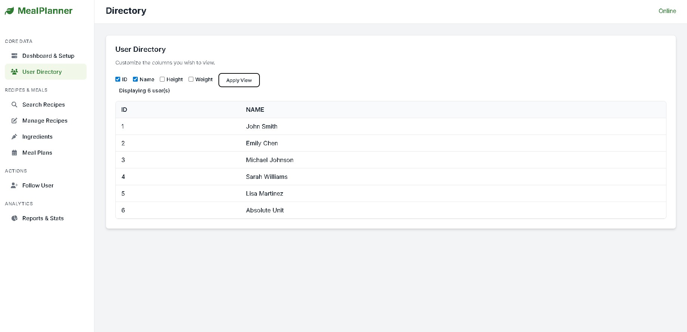
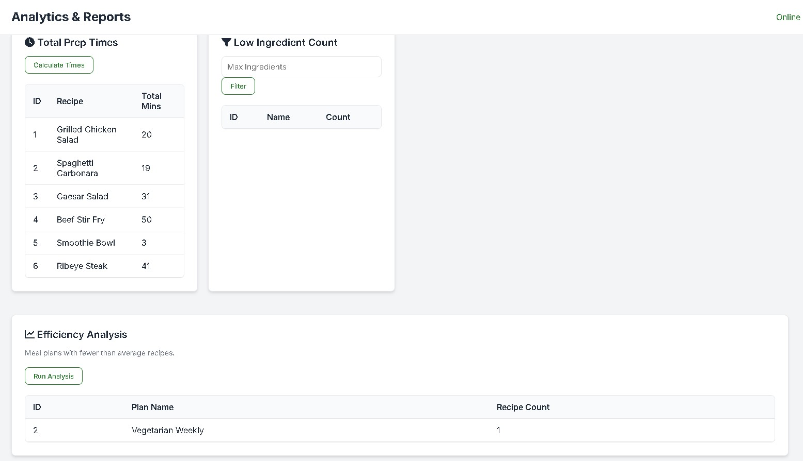

# Meal Planner Application

A web application for managing recipes, ingredients, and meal plans with a focus on complex database operations.

## Tech Stack

- **Backend**: Node.js, Express, Oracle Database 19c
- **Frontend**: HTML, CSS, JavaScript
- **Database**: 20+ normalized tables with foreign key relationships

## Features

- Recipe search with multi-criteria filtering (difficulty, temperature, creator)
- Ingredient-based recipe discovery
- User and meal plan management
- Analytics dashboard with aggregation queries
- CRUD operations with proper constraint handling

## Database Schema

Key tables: Users, Recipes, Ingredients, MealPlans, KitchenTools, DietaryRestrictions

Relationships include:
- Users create Recipes (1:N)
- Users follow MealPlans (M:N)
- Recipes use Ingredients (M:N)
- ISA hierarchy for DietaryRestrictions (Allergy/Preference)


## SQL Queries Implemented

1. **Insert**: Add users to meal plans with FK validation
2. **Update**: Modify recipe attributes (name, difficulty, creator)
3. **Delete**: Remove meal plans with cascade deletion
4. **Selection**: Multi-criteria search with AND/OR logic
5. **Projection**: Display custom user attributes
6. **Join**: Find recipes by ingredient (3-table join)
7. **Aggregation**: Calculate total recipe preparation time
8. **Having**: Filter recipes by ingredient count
9. **Nested Aggregation**: Find meal plans below average recipe count
10. **Division**: Find users following all meal plans

## Project Structure
```
├── public/
│   ├── index.html
│   ├── styles.css
│   └── scripts.js
├── appController.js       # API routes
├── appService.js          # Database operations
├── server.js              # Server setup
└── CreateAndPopulate.sql  # Database initialization
```






# Setup & Installation

## Prerequisites

Before you begin, make sure you have the following installed:

* **Node.js** (v14 or higher)
* **Oracle Database** (local installation or remote access)
* **Oracle Instant Client** (properly configured in your system PATH)

---

## 1. Clone & Install

Clone the repository and install dependencies:

```bash
git clone <your-repo-url>
cd meal-planning-app
npm install
```

---

## 2. Configure Database Connection

Create a `.env` file in the root directory of the project and add your Oracle database credentials:

```env
ORACLE_USER=your_username
ORACLE_PASS=your_password
ORACLE_HOST=localhost
ORACLE_PORT=1521
ORACLE_DBNAME=XEPDB1
PORT=65534
```

> Adjust these values according to your Oracle database setup.

---

## 3. Initialize Database

Run the SQL script to create tables and insert sample data.

1. Open SQL*Plus:

```bash
sqlplus your_username/your_password@localhost:1521/XEPDB1
```

2. Execute the SQL script:

```sql
@CreateAndPopulate.sql
```

3. Exit SQL*Plus:

```sql
exit
```

---

## 4. Start the Application

Start the Node.js server:

```bash
node server.js
```

Once the server is running, open your browser and visit:

```
http://localhost:65534
```


